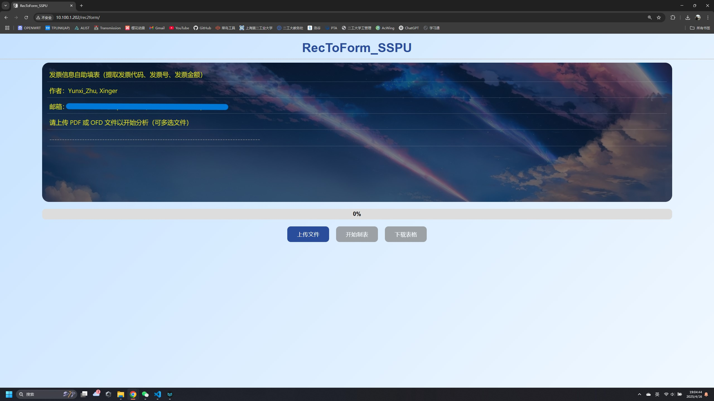

# 一、在线网页                                             **<u><mark>@竹云溪</mark></u>**

### I. 使用引导

（1）点击`上传文件`按钮，上传所需识别的发票文件（可多选, 可单选）

注意：一次性最多上传`50`个文件；单个文件的容量不得超过`10MB`

（2）点击`开始制表`按钮，后台程序开始分别文件并填写表格，请耐心等待

（3）点击`下载表格`按钮，下载所需表格（文件名为`发票信息.xlsx`）

### II. 效果预览

1. 初始入站

2. 上传文件

3. 分析文件并制作表格

4. 下载表格并查看
   
   

# 二、封装文件使用

请移步[RecToForm_SSPU/RecToForm_SSPU.exe](RecToForm_SSPU)下载发行文件，并查看使用说明[RecToForm_SSPU/README.md](RecToForm_SSPU%5CREADME.md)

（PS：内附主要代码具体说明，二次开发者可具体查看源码内容）

# 三、Web端代码说明（`RecToForm_SSPU_Web`）

### I.后端`RecToForm_back`

1. `main.py`程序入口

2. `functions`路由功能
   
   （1）`upload`负责上传文件
   
   （2）`analyze`负责调取`RecToForm_SSPU_Web.py`程序，实现识别发票并填表
   
   （3）`download`负责下载填写好的表格
   
   （4）`shared`负责存取中间信息（任务队列、定时清理缓存文件程序）

3. `requirements.txt`本项目所需全部环境（基于python 3.9）
