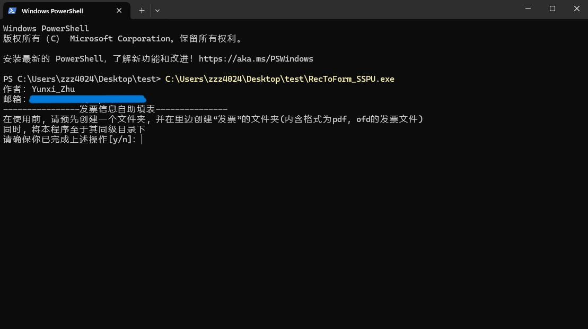

# <u>一. 封装文件的使用</u>                                   <u><mark>@竹云溪</mark></u>

1. 在桌面创建一个文件夹`test`（名称任意），并在内部创建存放发票的文件夹`发票`（名称指定）；同时，将封装好的程序`RecToForm_SSPU.exe`放置于同级目录下
   
   如图所示：
   
   


2. 在`test`文件夹下，右键打开命令窗，并将`RecToForm_SSPU.exe`拖拽至其中，回车运行。并在确认无误后，按`y`开始操作
   
   

3. 当所有发票分析完毕，程序回返回日志，并且前往`test`文件夹下查看输出的表格文件`发票信息.xlsx`


# <u>二、源码调用解释</u>

1. `RecToForm`类中有5个方法
   
   （1）`__init__`
   
   `in_path`存放发票文件夹的路径
   
   `out_path`表格文件的输出路径
   
   `message`对deepseek调用提出的需求
   
   `api_key`密钥
   
   `base_url`api调用地址
   
   `max_threads`最大线程调用数（默认为10）
   
   注意：调用本程序，仅需要修改`in_path`和`out_path`。其余参数若不需要，则无需修改
   
   （2）`getfile`
   
   作用：获取指定文件列表中各个文件, 首先把ofd格式转换为pdf格式, 再对pdf进行信息提取出字符串
   
   I. `self.pdf_informations:[str] = []  #pdf_informations列表中每个字符串为每张发票的具体信息`
   
   II. `self.pdf_names:[str] = [] #pdf_informations列表中为每张发票的文件名`
   
   （3）`useapi`
   
   作用：发送post请求, 调用api, 仅返回推理结果`cleaned_content`（纯字符串）
   
   （4）`recognize`
   
   作用：并发调用`useapi`方法，将`self.pdf_informations`提取的原始信息传给`deepseek`进行分析并提取数据，返回列表`self.dataframes`（其中每个元素均为发票信息的字典，包含发票代码、发票号、发票金额）
   
   （5）`fill`
   
   作用：填写表格

2. `hint`函数
   
   作用：作者信息 + 使用提示

# <u>三、前端设想及其说明</u>


（1）横线上方留空，前端设计者设计页头（标签、链接跳转）

（2）`RecToForm_SSPU`为该工具的名称

（3）中间的方框，可以设计信息实时显示。例如：

```python
文件8   餐饮110  已上传并分析
{'发票代码': '25322000000102267070', '发票号码': '25322000000102267070', '发票金额': '110.00'}
```

说明：日志信息的输出在`recognize`方法中

```python
print(f"文件{idx + 1}   {self.pdf_names[idx]}  已上传并分析\n{result}\n")
```

（4）进度条设计

根据总数进行均分，完成一次分析则前进一格

说明：总数可从`self.pdf_informations`列表获取

（5）上传文件按钮

设置一下输入路径`in_path`即可

（6）下载表格按钮

与（5）同理

（7）开始制表按钮

可以调用`hint`函数，若按下该按键，则返回`True`，执行程序

<u>**补充：**</u> 其余功能或者展示效果，可以根据你的想法来设计和改进

# <u>四、用户使用说明</u>


（1）本程序目前仅支持发票文件（pdf格式、ofd格式）

（2）点击``上传文件``按钮，选择你预先存放好的发票文件夹

（3）点击`开始制表`按钮，则可启动该程序进行发票分析、表格制取

（4）当进度条走满后，则可以点击`下载表格`按钮，将填写完的表格下载到本地
